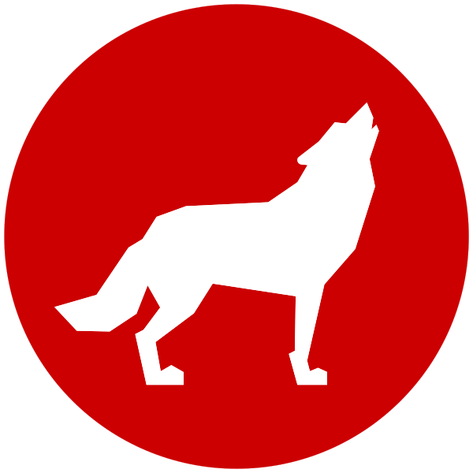
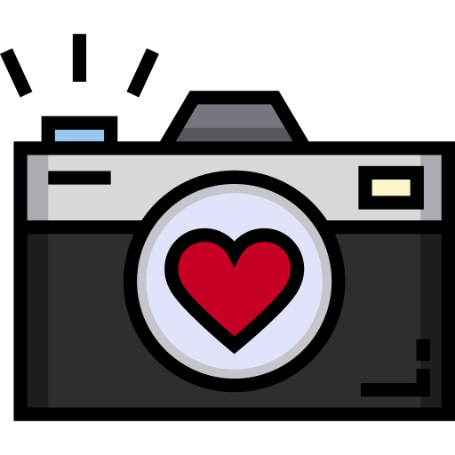

## Hi, I'm Lylan!

⠀⢀⣀⠀⠀⠀⠀⠀⢀⣀⠀ 
⢠⣯⢬⣷⡀⠀⠀⣴⡯⢌⣧ 
⠸⣿⠀⠹⣷⠀⢸⡝⠀⢸⡿ 
⠀⠻⣧⣀⣿⣦⣼⡁⣠⣿⠃ 
⠀⢀⡾⠋⠀⠀⠀⠈⣙⣯⠀ 
⠀⣾⠀⠀⠀⠀⠀⠀⠀⠸⡆ 
⢰⡧⢄⢰⡆⠀⢰⡆⡠⢄⣧ 
⠀⠳⣼⣤⣤⣤⣤⣤⣧⠾⠁
⠀⠀⠀⠀⠀⠀⠀⠀⠀⠀⠀

 &nbsp; North Carolina State University (Class of 2027) 
 &nbsp; Computer Science major, Data Science in Business minor 
- Music enthusiast 
 &nbsp; Concert photographer for fun! Check out my [`photography portfolio`](https://lylan.myportfolio.com/)

. ݁₊ ⊹ . ݁ ⟡ ݁ . ⊹ ₊ ݁.

<!--
**lylan-bui/lylan-bui** is a ✨ _special_ ✨ repository because its `README.md` (this file) appears on your GitHub profile.

Here are some ideas to get you started:

- 🔭 I’m currently working on ...
- 🌱 I’m currently learning ...
- 👯 I’m looking to collaborate on ...
- 🤔 I’m looking for help with ...
- 💬 Ask me about ...
- 📫 How to reach me: ...
- 😄 Pronouns: ...
- ⚡ Fun fact: ...
-->
